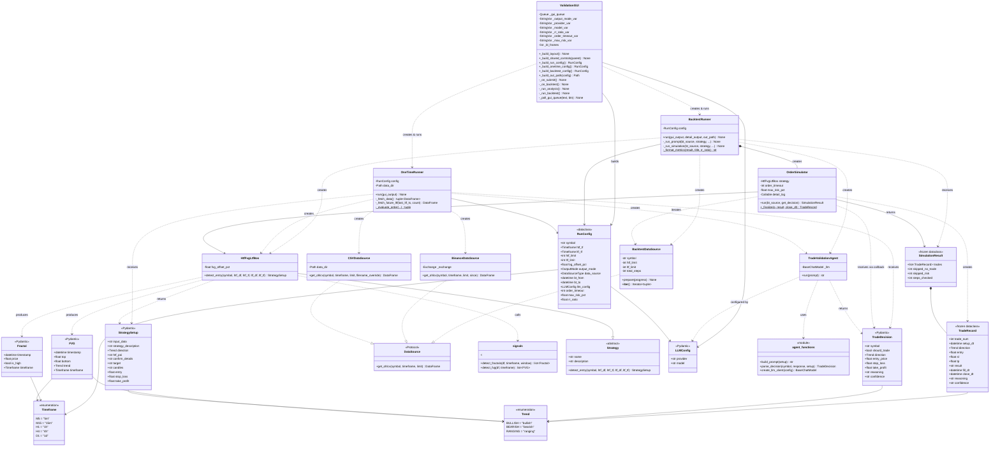

# Class Diagram — trading-validate

```mermaid
classDiagram
    direction TB

    %% ════════════════════════════════════════════════════════════
    %% ENUMS
    %% ════════════════════════════════════════════════════════════

    class Timeframe {
        <<enumeration>>
        M5 = "5m"
        M15 = "15m"
        H1 = "1h"
        H4 = "4h"
        D1 = "1d"
    }

    class Trend {
        <<enumeration>>
        BULLISH = "bullish"
        BEARISH = "bearish"
        RANGING = "ranging"
    }

    %% ════════════════════════════════════════════════════════════
    %% CORE MODELS  (core/models.py)
    %% ════════════════════════════════════════════════════════════

    class FVG {
        <<Pydantic>>
        +datetime timestamp
        +float top
        +float bottom
        +Trend trend
        +Timeframe timeframe
    }

    class Fractal {
        <<Pydantic>>
        +datetime timestamp
        +float price
        +bool is_high
        +Timeframe timeframe
    }

    class StrategySetup {
        <<Pydantic>>
        +str input_data
        +str strategy_description
        +Trend direction
        +str htf_poi
        +str confirm_details
        +str target
        +str candles
        +float entry
        +float stop_loss
        +float take_profit
    }

    class TradeDecision {
        <<Pydantic>>
        +str symbol
        +bool should_trade
        +Trend direction
        +float entry_price
        +float stop_loss
        +float take_profit
        +str reasoning
        +str confidence
    }

    %% ════════════════════════════════════════════════════════════
    %% DATA LAYER  (core/protocols.py + data/)
    %% ════════════════════════════════════════════════════════════

    class DataSource {
        <<Protocol>>
        +get_ohlcv(symbol, timeframe, limit) DataFrame
    }

    class CSVDataSource {
        -Path data_dir
        +get_ohlcv(symbol, timeframe, limit, filename_override) DataFrame
    }

    class BinanceDataSource {
        -Exchange _exchange
        +get_ohlcv(symbol, timeframe, limit, since) DataFrame
    }

    class BacktestDataSource {
        -str symbol
        -int htf_limit
        -int ltf_limit
        -int total_steps
        +prepare(progress) None
        +__iter__() Iterator~tuple~
    }

    %% ════════════════════════════════════════════════════════════
    %% SIGNALS  (signals/fractals.py + signals/fvg.py)
    %% ════════════════════════════════════════════════════════════

    class signals {
        <<module»
        +detect_fractals(df, timeframe, window) list~Fractal~
        +detect_fvg(df, timeframe) list~FVG~
    }

    %% ════════════════════════════════════════════════════════════
    %% STRATEGIES  (strategies/)
    %% ════════════════════════════════════════════════════════════

    class Strategy {
        <<abstract>>
        +str name
        +str description
        +detect_entry(symbol, htf_df, htf_tf, ltf_df, ltf_tf) StrategySetup
    }

    class HtfFvgLtfBos {
        -float fvg_offset_pct
        +detect_entry(symbol, htf_df, htf_tf, ltf_df, ltf_tf) StrategySetup
    }

    %% ════════════════════════════════════════════════════════════
    %% AGENTS  (agents/)
    %% ════════════════════════════════════════════════════════════

    class LLMConfig {
        <<Pydantic>>
        +str provider
        +str model
    }

    class TradeValidationAgent {
        -BaseChatModel _llm
        +run(prompt) str
    }

    class agent_functions {
        <<module>>
        +build_prompt(setup) str
        +parse_decision(symbol, response, setup) TradeDecision
        +create_llm_client(config) BaseChatModel
    }

    %% ════════════════════════════════════════════════════════════
    %% RUNNER — config  (runner/config.py)
    %% ════════════════════════════════════════════════════════════

    class RunConfig {
        <<dataclass>>
        +str symbol
        +Timeframe htf_tf
        +Timeframe ltf_tf
        +int htf_limit
        +int ltf_limit
        +float fvg_offset_pct
        +OutputMode output_mode
        +DataSourceType data_source
        +datetime bt_from
        +datetime bt_to
        +LLMConfig llm_config
        +int order_timeout
        +float max_risk_pct
        +float rr_ratio
    }

    class TradeRecord {
        <<frozen dataclass>>
        +int trade_num
        +datetime setup_dt
        +Trend direction
        +float entry
        +float sl
        +float tp
        +str result
        +datetime fill_dt
        +datetime close_dt
        +str reasoning
        +str confidence
    }

    class SimulationResult {
        <<frozen dataclass>>
        +list~TradeRecord~ trades
        +int skipped_no_trade
        +int skipped_risk
        +int steps_checked
    }

    %% ════════════════════════════════════════════════════════════
    %% RUNNER — classes  (runner/)
    %% ════════════════════════════════════════════════════════════

    class OrderSimulator {
        -HtfFvgLtfBos strategy
        -int order_timeout
        -float max_risk_pct
        -Callable detail_log
        +run(bt_source, get_decision) SimulationResult
        +_finalize(o, result, close_dt)$ TradeRecord
    }

    class OneTimeRunner {
        -RunConfig config
        -Path data_dir
        +run(gui_output) None
        -_fetch_data() tuple~DataFrame~
        -_fetch_future_ltf(last_ltf_ts, count) DataFrame
        -_evaluate_order(...)$ tuple
    }

    class BacktestRunner {
        -RunConfig config
        +run(gui_output, detail_output, out_path) None
        -_run_prompt(bt_source, strategy, ...) None
        -_run_simulation(bt_source, strategy, ...) None
        -_format_metrics(result, title, rr_ratio)$ str
    }

    %% ════════════════════════════════════════════════════════════
    %% GUI  (gui_validation.py)
    %% ════════════════════════════════════════════════════════════

    class ValidationGUI {
        -Queue _gui_queue
        -StringVar _output_mode_var
        -StringVar _provider_var
        -StringVar _model_var
        -StringVar _rr_ratio_var
        -StringVar _order_timeout_var
        -StringVar _max_risk_var
        -list _bl_frames
        +_build_layout() None
        +_build_shared_controls(parent) None
        +_build_run_config() RunConfig
        +_build_onetime_config() RunConfig
        +_build_backtest_config() RunConfig
        +_build_out_path(config) Path
        -_on_submit() None
        -_on_backtest() None
        -_run_analysis() None
        -_run_backtest() None
        -_poll_gui_queue(text, btn) None
    }

    %% ════════════════════════════════════════════════════════════
    %% RELATIONSHIPS
    %% ════════════════════════════════════════════════════════════

    %% --- Protocol implementations ---
    CSVDataSource        ..|> DataSource
    BinanceDataSource    ..|> DataSource
    BacktestDataSource   ..|> DataSource

    %% --- Strategy inheritance ---
    HtfFvgLtfBos         --|> Strategy

    %% --- Enum usage (field types) ---
    FVG                  --> Trend
    FVG                  --> Timeframe
    Fractal              --> Timeframe
    StrategySetup        --> Trend
    TradeDecision        --> Trend
    TradeRecord          --> Trend
    RunConfig            --> Timeframe
    RunConfig            --> LLMConfig

    %% --- Composition ---
    SimulationResult     *-- TradeRecord

    %% --- Signal detection ---
    HtfFvgLtfBos         ..> signals         : calls
    HtfFvgLtfBos         ..> FVG             : produces
    HtfFvgLtfBos         ..> Fractal         : produces
    HtfFvgLtfBos         ..> StrategySetup   : returns

    %% --- Agent ---
    TradeValidationAgent ..> LLMConfig        : configured by
    TradeValidationAgent ..> agent_functions  : uses
    TradeValidationAgent ..> TradeDecision    : returns

    %% --- OrderSimulator ---
    OrderSimulator       --> HtfFvgLtfBos     : uses
    OrderSimulator       ..> BacktestDataSource : iterates
    OrderSimulator       ..> TradeDecision    : receives via callback
    OrderSimulator       ..> TradeRecord      : creates
    OrderSimulator       --> SimulationResult : returns

    %% --- OneTimeRunner ---
    OneTimeRunner        --> RunConfig
    OneTimeRunner        ..> HtfFvgLtfBos     : creates
    OneTimeRunner        ..> CSVDataSource    : creates
    OneTimeRunner        ..> BinanceDataSource : creates
    OneTimeRunner        ..> TradeValidationAgent : creates
    OneTimeRunner        ..> StrategySetup    : receives
    OneTimeRunner        ..> TradeDecision    : receives

    %% --- BacktestRunner ---
    BacktestRunner       --> RunConfig
    BacktestRunner       ..> HtfFvgLtfBos     : creates
    BacktestRunner       ..> BacktestDataSource : creates
    BacktestRunner       ..> TradeValidationAgent : creates
    BacktestRunner       *-- OrderSimulator    : creates
    BacktestRunner       ..> SimulationResult : receives

    %% --- GUI ---
    ValidationGUI        --> RunConfig        : builds
    ValidationGUI        ..> OneTimeRunner    : creates & runs
    ValidationGUI        ..> BacktestRunner   : creates & runs
    ValidationGUI        --> LLMConfig
```
