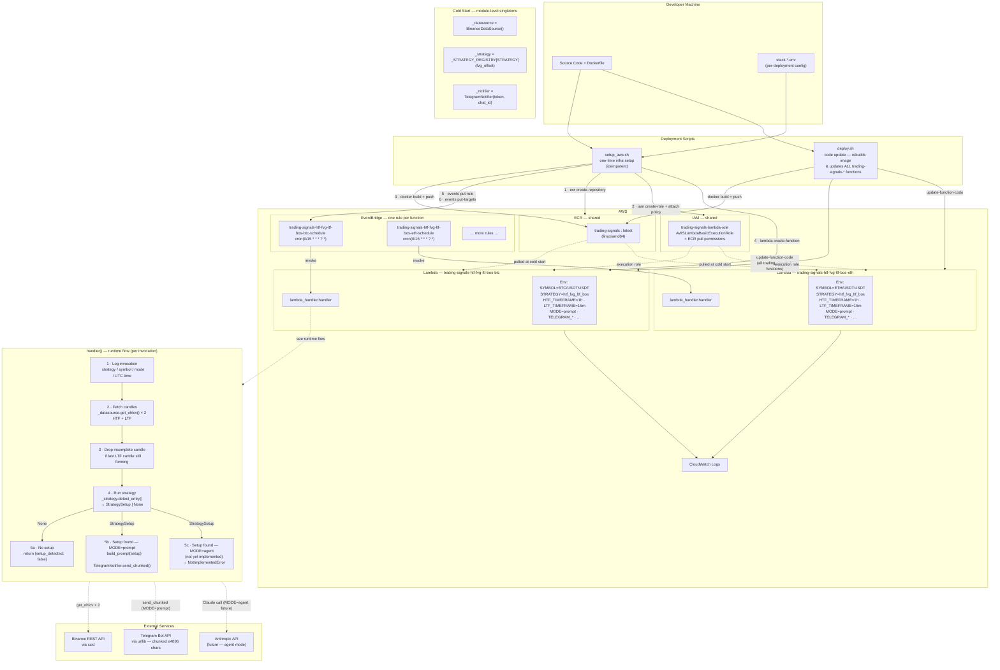

# Deployment Diagram — Lambda Container Architecture

```mermaid
flowchart TB
    subgraph dev[Developer Machine]
        src[Source Code + Dockerfile]
        stack_env["stack-*.env\n(per-deployment config)"]
    end

    subgraph scripts[Deployment Scripts]
        setup["setup_aws.sh\none-time infra setup\n(idempotent)"]
        deploy["deploy.sh\ncode update — rebuilds image\n& updates ALL trading-signals-* functions"]
    end

    subgraph aws[AWS]
        subgraph ecr[ECR — shared]
            image["trading-signals : latest\n(linux/amd64)"]
        end

        subgraph iam[IAM — shared]
            role["trading-signals-lambda-role\nAWSLambdaBasicExecutionRole\n+ ECR pull permissions"]
        end

        subgraph eb[EventBridge — one rule per function]
            rule_a["trading-signals-htf-fvg-ltf-bos-btc-schedule\ncron(0/15 * * * ? *)"]
            rule_b["trading-signals-htf-fvg-ltf-bos-eth-schedule\ncron(0/15 * * * ? *)"]
            rule_n["… more rules …"]
        end

        subgraph lambda_a["Lambda — trading-signals-htf-fvg-ltf-bos-btc"]
            env_a["Env: SYMBOL=BTC/USDT:USDT\nSTRATEGY=htf_fvg_ltf_bos\nHTF_TIMEFRAME=1h · LTF_TIMEFRAME=15m\nMODE=prompt · TELEGRAM_* · …"]
            handler_a[lambda_handler.handler]
        end

        subgraph lambda_b["Lambda — trading-signals-htf-fvg-ltf-bos-eth"]
            env_b["Env: SYMBOL=ETH/USDT:USDT\nSTRATEGY=htf_fvg_ltf_bos\nHTF_TIMEFRAME=1h · LTF_TIMEFRAME=15m\nMODE=prompt · TELEGRAM_* · …"]
            handler_b[lambda_handler.handler]
        end

        cw[CloudWatch Logs]
    end

    subgraph handler_detail["handler() — runtime flow (per invocation)"]
        direction TB
        h1["1 · Log invocation\n   strategy / symbol / mode / UTC time"]
        h2["2 · Fetch candles\n   _datasource.get_ohlcv() × 2\n   HTF + LTF"]
        h3["3 · Drop incomplete candle\n   if last LTF candle still forming"]
        h4["4 · Run strategy\n   _strategy.detect_entry()\n   → StrategySetup | None"]
        h5a["5a · No setup\n    return {setup_detected: false}"]
        h5b["5b · Setup found — MODE=prompt\n    build_prompt(setup)\n    TelegramNotifier.send_chunked()"]
        h5c["5c · Setup found — MODE=agent\n    (not yet implemented)\n    → NotImplementedError"]
        h1 --> h2 --> h3 --> h4
        h4 -->|None| h5a
        h4 -->|StrategySetup| h5b
        h4 -->|StrategySetup| h5c
    end

    subgraph cold_start["Cold Start — module-level singletons"]
        cs1["_datasource = BinanceDataSource()"]
        cs2["_strategy = _STRATEGY_REGISTRY[STRATEGY](fvg_offset)"]
        cs3["_notifier = TelegramNotifier(token, chat_id)"]
    end

    subgraph external[External Services]
        binance[Binance REST API\nvia ccxt]
        telegram[Telegram Bot API\nvia urllib — chunked ≤4096 chars]
        anthropic["Anthropic API\n(future — agent mode)"]
    end

    %% ── Setup flow ──────────────────────────────────────────────
    src --> setup
    stack_env --> setup
    src --> deploy

    setup -- "1 · ecr create-repository" --> ecr
    setup -- "2 · iam create-role + attach policy" --> iam
    setup -- "3 · docker build + push" --> image
    setup -- "4 · lambda create-function" --> lambda_a
    setup -- "5 · events put-rule\n6 · events put-targets" --> rule_a

    deploy -- "docker build + push" --> image
    deploy -- "update-function-code\n(all trading-signals-* functions)" --> lambda_a
    deploy -- "update-function-code" --> lambda_b

    %% ── Shared resource links ────────────────────────────────────
    image -. "pulled at cold start" .-> lambda_a
    image -. "pulled at cold start" .-> lambda_b
    role -. "execution role" .-> lambda_a
    role -. "execution role" .-> lambda_b

    %% ── Trigger flow ─────────────────────────────────────────────
    rule_a -- "invoke" --> handler_a
    rule_b -- "invoke" --> handler_b

    %% ── Runtime detail ───────────────────────────────────────────
    handler_a -. "see runtime flow" .-> handler_detail
    handler_detail -. "get_ohlcv × 2" .-> binance
    handler_detail -. "send_chunked (MODE=prompt)" .-> telegram
    handler_detail -. "Claude call (MODE=agent, future)" ..-> anthropic

    lambda_a --> cw
    lambda_b --> cw
```
